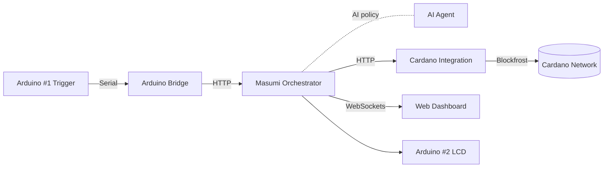
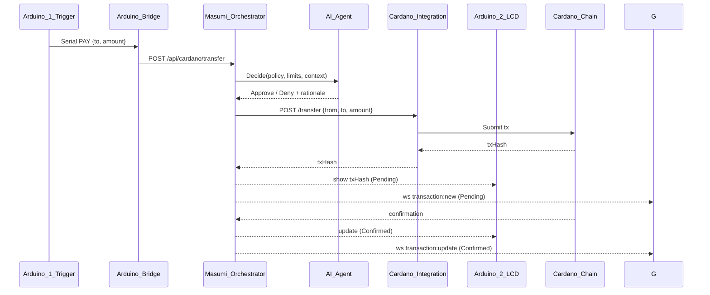
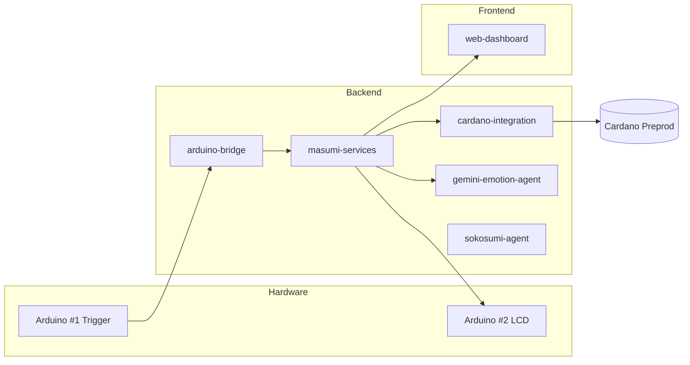

# Arduino ↔ Cardano: AI‑Agent Orchestrated Machine‑to‑Machine Demo

This demonstration shows machine (Arduino) → AI‑agent → machine (Arduino) interaction: an AI agent interprets the intent from one Arduino, Masumi orchestrates the policy and execution, and the transaction is performed on the Cardano blockchain, with results shown on another Arduino.

- Machine (Arduino) → AI‑agent decision → Machine (Arduino)
- AI‑agent mediated interaction becomes an on‑chain Cardano transaction
- Masumi handles orchestration; Cardano handles settlement

## 🎥 Demo Videos

### 🏆 Hackathon Day Demo
Live Arduino → Cardano → LCD + Dashboard

<div align="center">
  <a href="https://youtu.be/UafLTltfD5o">
    
  </a>
  <p><em>Click to watch: button press → Cardano tx → LCD + dashboard</em></p>
</div>

Watch on YouTube: https://youtu.be/UafLTltfD5o

---

### 🚀 Future Vision Demo
Fun preview of real‑world usage

<div align="center">
  <a href="https://youtu.be/tLkZvUDTP0s">
    
  </a>
  <p><em>Click to watch: how this tech fits real scenarios</em></p>
</div>

Watch on YouTube: https://youtu.be/tLkZvUDTP0s

---

## 🧩 What this demonstrates

- AI‑agent powered M2M flow
  - Arduino (button/sensor) requests a payment/interaction
  - AI agent (Gemini/Sokosumi) interprets and authorizes intent
  - Masumi orchestrates policy, limits, routing, and execution
  - Cardano Integration builds/signs/submits the on‑chain transaction
  - Arduino (LCD) shows live status (Pending → Confirmed)
- Tangible blockchain feedback on 16×2 I2C LCD
- End‑to‑end microservices from serial to blockchain

## 🏗️ Architecture (overview)



### Sequence (button press → confirmation)



## 🔩 Hardware

- Arduino #1 — Payment Trigger (COM6)
  - Button: D2 (pull‑up)
  - LEDs: 13=success, 12=processing, 11=error
- Arduino #2 — Transaction Display (COM3)
  - I2C LCD: SDA=A4, SCL=A5 (Uno)

Optional:
- Soil moisture sensor (A0) + AI plant‑health analysis

## 🖥️ Services (folders)

- backend/arduino-bridge — Serial ↔ HTTP gateway (Port 5001)
- backend/masumi-services — Orchestration & policy (Port 3001)
- backend/cardano-integration — Build/sign/submit Cardano tx (Port 4002)
- backend/gemini-emotion-agent, backend/sokosumi-agent — AI decision services
- frontend/web-dashboard — Live tx and telemetry (Port 8090)
- keys/ — Preprod addresses, CBOR, wallet info
- scripts/ — Wallet generation and helpers

---

## ⚙️ Setup A: Local (Windows)

Prerequisites:
- Node.js 18+
- Arduino IDE
- Blockfrost preprod API key (for Cardano Integration)
- Two COM ports (e.g., COM6 for trigger, COM3 for LCD)

1) Install service dependencies
```powershell
cd backend\masumi-services; npm install
cd ..\arduino-bridge; npm install
cd ..\cardano-integration; npm install
cd ..\gemini-emotion-agent; npm install
```

2) Configure environments
```powershell
copy backend\arduino-bridge\.env.example backend\arduino-bridge\.env
copy backend\masumi-services\.env.example backend\masumi-services\.env
copy backend\cardano-integration\.env.example backend\cardano-integration\.env
```

Minimum Arduino Bridge settings:
```
SERIAL_PORT=COM6
BAUD_RATE=9600
MASUMI_PAYMENT_URL=http://localhost:3001/api/cardano/transfer
```

3) Generate a Cardano preprod wallet
```powershell
cd scripts
.\generate-cardano-preprod-wallet.ps1
```

4) Start services (in separate terminals)
```powershell
cd backend\masumi-services; npm start
cd ..\arduino-bridge; npm start
cd ..\cardano-integration; npm start
cd ..\gemini-emotion-agent; npm start
```

5) Upload Arduino sketches
- COM6: hardware/arduino-uno/payment_trigger.ino
- COM3: hardware/arduino-uno/transaction_display.ino

6) Run dashboard
```powershell
cd frontend\web-dashboard
npm install
npm start
```
Open http://localhost:8090

---

## 🐳 Setup B: Docker (Compose)

Prerequisites:
- Docker Desktop (Windows)

Note: Accessing Windows COM ports from Docker is limited. Recommended: run arduino-bridge locally and containerize the rest.

1) Create docker-compose.yml (repo root)
```yaml
version: "3.9"
services:
  masumi-services:
    build: ./backend/masumi-services
    ports: ["3001:3001"]
    env_file:
      - ./backend/masumi-services/.env

  cardano-integration:
    build: ./backend/cardano-integration
    ports: ["4002:4002"]
    env_file:
      - ./backend/cardano-integration/.env
    depends_on: [masumi-services]

  gemini-emotion-agent:
    build: ./backend/gemini-emotion-agent
    ports: ["6001:6001"]

  web-dashboard:
    build: ./frontend/web-dashboard
    ports: ["8090:8090"]
    depends_on: [masumi-services, cardano-integration]

  # Recommended: run arduino-bridge locally on Windows for COM access
  # On Linux, you could map serial devices like below:
  # arduino-bridge:
  #   build: ./backend/arduino-bridge
  #   ports: ["5001:5001"]
  #   env_file:
  #     - ./backend/arduino-bridge/.env
  #   devices:
  #     - "/dev/ttyUSB0:/dev/ttyUSB0"
  #     - "/dev/ttyUSB1:/dev/ttyUSB1"
  #   group_add:
  #     - dialout
  #   depends_on: [masumi-services]
```

2) Build and start
```powershell
docker compose up -d --build
docker compose ps
```

3) Start arduino-bridge locally (recommended on Windows)
```powershell
cd backend\arduino-bridge
npm start
```

4) Upload Arduino sketches (outside Docker)
- COM6: hardware/arduino-uno/payment_trigger.ino
- COM3: hardware/arduino-uno/transaction_display.ino

5) Open the dashboard
- http://localhost:8090

---

## 🧭 Component Map



## ✅ Quick Test

- Trigger (manual):
```powershell
curl -X POST http://localhost:5001/trigger
```

- Check services:
```powershell
curl http://localhost:3001/health
curl http://localhost:4002/health
```

## 🔌 Troubleshooting

- LCD blank: see docs/LCD_TROUBLESHOOTING.md and docs/LCD_WIRING_FIX.md
- No transaction: verify MASUMI_PAYMENT_URL, Blockfrost/API keys, and wallet funds (preprod)
- COM ports: set SERIAL_PORT to your actual COM6/COM3 values
- Docker + Serial (Windows): run arduino-bridge locally for COM access

## 📚 More Docs

- /deployment-status.md
- /sokosumi-integration-status.md

## 📜 License & Attributions

This project is licensed under the **MIT License**.

### Third-Party Libraries & Components

This project utilizes the following open-source libraries and tools:

#### **Arduino Libraries**
- **hd44780** by Bill Perry - LCD library with auto-detect I2C support (GPL-3.0)
- **DHT sensor library** by Adafruit - Temperature & humidity sensor (BSD License)
- **Adafruit Unified Sensor** by Adafruit - Unified sensor driver (Apache-2.0)
- **Arduino Core Libraries** - Standard Arduino libraries (LGPL-2.1)

#### **Node.js / JavaScript**
- **SerialPort** - Serial communication library (MIT)
- **Express.js** - Web framework (MIT)
- **Axios** - HTTP client (MIT)
- **dotenv** - Environment variable management (BSD-2-Clause)

#### **Python**
- **PySerial** - Python serial port access (BSD-3-Clause)
- **Requests** - HTTP library (Apache-2.0)

#### **Cardano Ecosystem**
- **Cardano Node** - Blockchain infrastructure (Apache-2.0)
- **cardano-cli** - Command-line interface (Apache-2.0)
- **Cardano PreProd Testnet** - Test network infrastructure

#### **MCP (Model Context Protocol)**
- **Sokosumi MCP Server** - Custom MCP server for plant monitoring (MIT)
- **Claude Desktop Integration** - AI assistant integration (Anthropic Terms of Service)

#### **Hardware Components**
- **Arduino Uno** - Microcontroller platform (CC BY-SA)
- **DHT22** - Digital temperature and humidity sensor
- **YL-69 / HL-69** - Capacitive soil moisture sensor
- **I2C LCD Display (16x2)** with PCF8574 I/O expander

### License Compliance

All third-party components are used in compliance with their respective licenses. Full license texts are available in the `LICENSES/` directory or from the original project repositories.

---

## 🙏 Thank You

We sincerely thank the IndiaCodex Hackathon 2025 organizers and judges for this incredible opportunity to showcase innovation at the intersection of blockchain technology and sustainable agriculture. Special appreciation to the Cardano community for their excellent documentation and testnet infrastructure, the Arduino community for robust hardware libraries, Anthropic for Claude and MCP framework, and all open-source contributors whose libraries and tools made this project possible. This hackathon has been an inspiring journey in pushing the boundaries of what's possible when cutting-edge technology meets real-world agricultural challenges.

**Team**: ActuAlte Robotics  
**Repository**: [IndiaCodexHackathon--25-Submission](https://github.com/DhanushKenkiri/IndiaCodexHackathon--25-Submission)  
**Default Branch**: hackathon-submission  
**License**: MIT

---

### MIT License

```
MIT License

Copyright (c) 2025 Masumi Cardano Hardware Implementation Team

Permission is hereby granted, free of charge, to any person obtaining a copy
of this software and associated documentation files (the "Software"), to deal
in the Software without restriction, including without limitation the rights
to use, copy, modify, merge, publish, distribute, sublicense, and/or sell
copies of the Software, and to permit persons to whom the Software is
furnished to do so, subject to the following conditions:

The above copyright notice and this permission notice shall be included in all
copies or substantial portions of the Software.

THE SOFTWARE IS PROVIDED "AS IS", WITHOUT WARRANTY OF ANY KIND, EXPRESS OR
IMPLIED, INCLUDING BUT NOT LIMITED TO THE WARRANTIES OF MERCHANTABILITY,
FITNESS FOR A PARTICULAR PURPOSE AND NONINFRINGEMENT. IN NO EVENT SHALL THE
AUTHORS OR COPYRIGHT HOLDERS BE LIABLE FOR ANY CLAIM, DAMAGES OR OTHER
LIABILITY, WHETHER IN AN ACTION OF CONTRACT, TORT OR OTHERWISE, ARISING FROM,
OUT OF OR IN CONNECTION WITH THE SOFTWARE OR THE USE OR OTHER DEALINGS IN THE
SOFTWARE.
```
