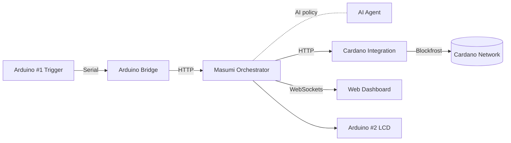
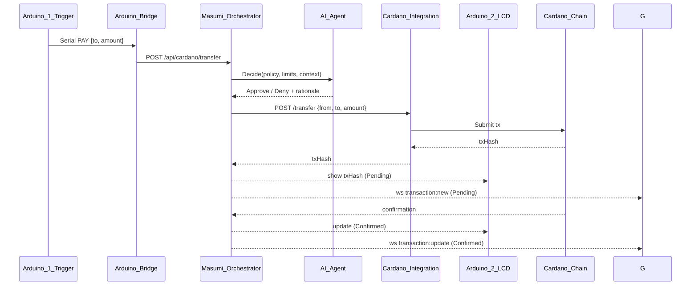
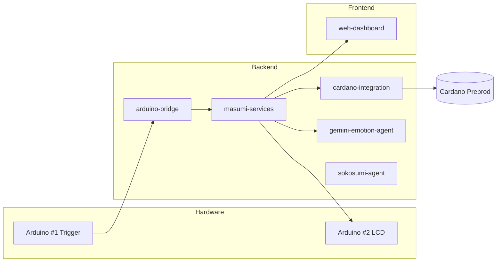

# Arduino ↔ Cardano: AI‑Agent Orchestrated Machine‑to‑Machine Demo

This demonstration shows machine (Arduino) → AI‑agent → machine (Arduino) interaction: an AI agent interprets the intent from one Arduino, Masumi orchestrates the policy and execution, and the transaction is performed on the Cardano blockchain, with results shown on another Arduino.

- Machine (Arduino) → AI‑agent decision → Machine (Arduino)
- AI‑agent mediated interaction becomes an on‑chain Cardano transaction
- Masumi handles orchestration; Cardano handles settlement

## 🎥 Demo Videos

### 🏆 Hackathon Day Demo
Live Arduino → Cardano → LCD + Dashboard

<div align="center">
  <a href="https://youtu.be/UafLTltfD5o">
    
  </a>
  <p><em>Click to watch: button press → Cardano tx → LCD + dashboard</em></p>
</div>

Watch on YouTube: https://youtu.be/UafLTltfD5o

---

### 🚀 Future Vision Demo
Fun preview of real‑world usage

<div align="center">
  <a href="https://youtu.be/tLkZvUDTP0s">
    
  </a>
  <p><em>Click to watch: how this tech fits real scenarios</em></p>
</div>

Watch on YouTube: https://youtu.be/tLkZvUDTP0s

---

## 🧩 What this demonstrates

- AI‑agent powered M2M flow
  - Arduino (button/sensor) requests a payment/interaction
  - AI agent (Gemini/Sokosumi) interprets and authorizes intent
  - Masumi orchestrates policy, limits, routing, and execution
  - Cardano Integration builds/signs/submits the on‑chain transaction
  - Arduino (LCD) shows live status (Pending → Confirmed)
- Tangible blockchain feedback on 16×2 I2C LCD
- End‑to‑end microservices from serial to blockchain

## 🏗️ Architecture (overview)



### Sequence (button press → confirmation)



## 🔩 Hardware

- Arduino #1 — Payment Trigger (COM6)
  - Button: D2 (pull‑up)
  - LEDs: 13=success, 12=processing, 11=error
- Arduino #2 — Transaction Display (COM3)
  - I2C LCD: SDA=A4, SCL=A5 (Uno)

Optional:
- Soil moisture sensor (A0) + AI plant‑health analysis

## 🖥️ Services (folders)

- backend/arduino-bridge — Serial ↔ HTTP gateway (Port 5001)
- backend/masumi-services — Orchestration & policy (Port 3001)
- backend/cardano-integration — Build/sign/submit Cardano tx (Port 4002)
- backend/gemini-emotion-agent, backend/sokosumi-agent — AI decision services
- frontend/web-dashboard — Live tx and telemetry (Port 8090)
- keys/ — Preprod addresses, CBOR, wallet info
- scripts/ — Wallet generation and helpers

---

## ⚙️ Setup A: Local (Windows)

Prerequisites:
- Node.js 18+
- Arduino IDE
- Blockfrost preprod API key (for Cardano Integration)
- Two COM ports (e.g., COM6 for trigger, COM3 for LCD)

1) Install service dependencies
```powershell
cd backend\masumi-services; npm install
cd ..\arduino-bridge; npm install
cd ..\cardano-integration; npm install
cd ..\gemini-emotion-agent; npm install
```

2) Configure environments
```powershell
copy backend\arduino-bridge\.env.example backend\arduino-bridge\.env
copy backend\masumi-services\.env.example backend\masumi-services\.env
copy backend\cardano-integration\.env.example backend\cardano-integration\.env
```

Minimum Arduino Bridge settings:
```
SERIAL_PORT=COM6
BAUD_RATE=9600
MASUMI_PAYMENT_URL=http://localhost:3001/api/cardano/transfer
```

3) Generate a Cardano preprod wallet
```powershell
cd scripts
.\generate-cardano-preprod-wallet.ps1
```

4) Start services (in separate terminals)
```powershell
cd backend\masumi-services; npm start
cd ..\arduino-bridge; npm start
cd ..\cardano-integration; npm start
cd ..\gemini-emotion-agent; npm start
```

5) Upload Arduino sketches
- COM6: hardware/arduino-uno/payment_trigger.ino
- COM3: hardware/arduino-uno/transaction_display.ino

6) Run dashboard
```powershell
cd frontend\web-dashboard
npm install
npm start
```
Open http://localhost:8090

---

## 🐳 Setup B: Docker (Compose)

Prerequisites:
- Docker Desktop (Windows)

Note: Accessing Windows COM ports from Docker is limited. Recommended: run arduino-bridge locally and containerize the rest.

1) Create docker-compose.yml (repo root)
```yaml
version: "3.9"
services:
  masumi-services:
    build: ./backend/masumi-services
    ports: ["3001:3001"]
    env_file:
      - ./backend/masumi-services/.env

  cardano-integration:
    build: ./backend/cardano-integration
    ports: ["4002:4002"]
    env_file:
      - ./backend/cardano-integration/.env
    depends_on: [masumi-services]

  gemini-emotion-agent:
    build: ./backend/gemini-emotion-agent
    ports: ["6001:6001"]

  web-dashboard:
    build: ./frontend/web-dashboard
    ports: ["8090:8090"]
    depends_on: [masumi-services, cardano-integration]

  # Recommended: run arduino-bridge locally on Windows for COM access
  # On Linux, you could map serial devices like below:
  # arduino-bridge:
  #   build: ./backend/arduino-bridge
  #   ports: ["5001:5001"]
  #   env_file:
  #     - ./backend/arduino-bridge/.env
  #   devices:
  #     - "/dev/ttyUSB0:/dev/ttyUSB0"
  #     - "/dev/ttyUSB1:/dev/ttyUSB1"
  #   group_add:
  #     - dialout
  #   depends_on: [masumi-services]
```

2) Build and start
```powershell
docker compose up -d --build
docker compose ps
```

3) Start arduino-bridge locally (recommended on Windows)
```powershell
cd backend\arduino-bridge
npm start
```

4) Upload Arduino sketches (outside Docker)
- COM6: hardware/arduino-uno/payment_trigger.ino
- COM3: hardware/arduino-uno/transaction_display.ino

5) Open the dashboard
- http://localhost:8090

---

## 🧭 Component Map



## ✅ Quick Test

- Trigger (manual):
```powershell
curl -X POST http://localhost:5001/trigger
```

- Check services:
```powershell
curl http://localhost:3001/health
curl http://localhost:4002/health
```

## 🔌 Troubleshooting

- LCD blank: see docs/LCD_TROUBLESHOOTING.md and docs/LCD_WIRING_FIX.md
- No transaction: verify MASUMI_PAYMENT_URL, Blockfrost/API keys, and wallet funds (preprod)
- COM ports: set SERIAL_PORT to your actual COM6/COM3 values
- Docker + Serial (Windows): run arduino-bridge locally for COM access

## 📚 More Docs

- /deployment-status.md
- /sokosumi-integration-status.md

For license information, go back to the repository folder and see the LICENSE file.
